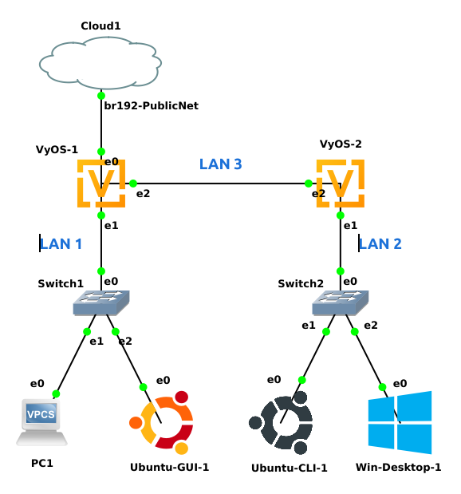

## ITS 4900 SDx Homework 01 - Basic Connectivity and Static Routing

### Goals

-   Learn basic setup of VyOS routers

-   Learn to configure network interface cards in common operating
    systems

-   Learn to use basic networking configuration and testing tools

-   Learn to use a Wireshark packet capture tool

-   Configure GNS3 Simulator, configure virtual networking equipment and
    node objects (i.e. child VMs)

### Resources 

-   Network diagram is at the end of this document.

-   Ohio University (OU), Domain Name Servers (DNS) are: 132.235.9.75
    and 132.235.200.41

-   On Blackboard each student has been issued a single static address in 132.235.160.192/26 network. Gateway follows class convention (ens192). **XXX** = Your personal 132.235.160.**XXX**/26 IP address.

-   On Blackboard each student has been issued a (Pseudo-Public) network of 100.70.**KKK**.0/24. This network is routed to the 132.235.160.XXX address (ens192). **KKK** = assigned student number.

### Pre-Lab

-   Complete Subnetting Documentation and Network Diagram at end of Lab Writeup

-   Tech Nuggets to be reviewed:

    -   [ECT Tech Nugget N2.1 IPv4 Subnetting Part
        1](https://youtu.be/uwa7w37LhF0), [ECT Tech Nugget N2.1 IPv4 Subnetting Part 2](https://youtu.be/K-yAX1OHNSI)

    -   [ECT Tech Nugget N2.3 IPv4 Subnetting Binary Method](https://youtu.be/A_JbKcmjyts) (if you like math)

    -   [ECT Tech Nugget N3.0 Routing Part 1](https://youtu.be/nx7PfG7_Fks), [ECT Tech Nugget N3.0 Routing Part 2](https://youtu.be/gVAEopOYGa0)

    -   [ECT Tech Nugget N1.1 GNS3](https://youtu.be/w5qsM3LhpQI), [ECT Tech Nugget N1.2 GNS3](https://youtu.be/X_LX4MCR1do), [ECT Tech Nugget N1.3 GNS3](https://youtu.be/5ZZjxAYcy5Q)

    -   [ECT Tech Nugget N4.0 VyOS and GNS3 Part 1](https://youtu.be/POqlACy94ys), [ECT Tech Nugget N4.0 VyOS and GNS3 Part 2](https://youtu.be/xtt3UO4gW7A)

-   VyOS User Guide - <https://docs.vyos.io/en/latest/index.html>

-   VyOS Ethernet Configuration - <https://docs.vyos.io/en/latest/interfaces/ethernet.html>

-   VyOS Static Routing - <https://docs.vyos.io/en/latest/routing/static.html>

### Lab Troubleshooting

You **[will]** run into issues with the router configuration going through this lab (troubleshooting by design), when something does not work the expectation is that the student will debug the issue before asking for help.

### Lab Startup Configuration

1.  Start RDP connection to student host GNS3 VM.

2.  Start GNS3 and start a new GNS3 project called: Lab 1 - SDx Static Routing

### GNS3 Project Configuration

3.  Setup objects and connections as shown in the Network Diagram at the end of the lab writeup.

4.  Start VyOS-1 machine. [Tip] Right-Click and select Start.

### VyOS-1 Configuration

5.  Open the console of VyOS-1 login and configure eth0, eth1 and eth2 interfaces. Reference VyOS configuration commands learned in class, online guides to ECT Tech Nuggets if needed.

WAN eth0 Example:

```
set interfaces ethernet eth0 address 132.235.160.X/26
set interfaces ethernet eth0 description WAN
```

LAN eth1 Example:
```
set interfaces ethernet eth1 address 100.70.KKK.62/26
set interfaces ethernet eth1 description LAN1
```
LAN eth2 Example:
```
set interfaces ethernet eth2 address 100.70.KKK.254/28
set interfaces ethernet eth2 description IntraNet
```
6.  The default route will also need to be configured. This only needs
    to be done **[once per router]**.

Example:
```
set protocols static route 0.0.0.0/0 next-hop 132.235.160.254
```
7.  Add nameservers. This only needs to be done once per router. (They may already be configured).
Example:
```
set system name-server 132.235.9.75
set system name-server 132.235.200.41
```
8.  Commit and save changes. Note and FIX any errors!

9.  Test connectivity by pinging and tracerouting from VyOS-1 to 8.8.8.8 (internet).

### VyOS-2 Router Configuration - Branch Office

10. Using the VyOS-2 console use ***similar*** steps from above and data from the prelab configure VyOS-2 eth1, eth2. Set default route to the IP of VyOS-1 eth2.

11. From VyOS-2 console ping VyOS-1's eth2 IP.

12. From VyOS-2 console ping www.ohio.edu

13. From VyOS-2 console SSH to VyOS-1 eth1 IP (Syntax: ssh itsclass@X.X.X.X). Login with the usual username/PW. It is common to SSH into physical or virtual machines (esp. routers) this way.

### Client Config

14. From VPCS-1 console use the following syntax to configure VPCS with static IP.

ip 100.70.Y.A/26 100.70.KKK.B

Y = IP address chosen for VPCS

B = IP address for gateway (VyOS-1 eth1)

15. From VPCS-1 console test connection to gateway by running: ``` ping 100.70.KKK.B```

16. From Linux GUI setup the NIC. Click on the Connection Manager Icon  in the upper right corner of the screen. The "Network Connections" dialog will appear giving options
    to configure ethernet interfaces (even disabled ones) on the machine. To edit the Ethernet (ens3) interface find the "Wired Settings" menu option. This will open the network settings options. Next to Ethernet (ens3) there are two options. A slider to turn the NIC off/on and a gear icon . Select the gear to edit additional settings of the NIC. Select IPv4 from the menu options across the top.
    
    On the IPv4 tab select "Manual" (if not already selected) from the IPv4 Method. The netmask option can be filled in with dotted decimal (example: 255.255.255.0) or slash notation (/24). Do not forget to add the DNS servers. When done click on the "Apply" button in the upper right of the dialog box. The NIC should be active with new settings.

17. In Ubuntu-GUI the settings will not be applied until the NIC is turned off and then back on. In the GUI turn the slider (light switch looking thing) to Off and then back to On. Reboot will work too but takes longer.

18. In Linux GUI test connection to gateway by running: ```ping 100.70.KKK.B```

19. Switch to Windows machine. Opening network settings is usually done by getting into the setting page. An icon has been added to the desktop of the Windows machine for quicker access. Open the "Network" icon from the desktop.

20. There will be five (or more) entries on the list. Ethernet 5-8 and "Npcap Lookback Adapter". All, except Ethernet 5, have a red x next to them indicating they are not connected physically (sigh...well virtua-physically). You can rename the NIC if you like with the context menu.

21. Right-Click and select Properties at the bottom of the menu. This will open the properties of the NIC. From this child menu double-click on "Internet Protocol Version 4 (TCP/IPv4)". Opening yet another child window, sigh.

22. Add DNS (aka nameservers) using the Advanced button at bottom and then in the DNS tab.

23. Change both radio option to the lower choices (they will un-gray) and fill in the necessary info then click OK and both child windows.

24. In Ubuntu CLI configure the ens3 aka "Wired connection 1" using nmcli commands.
Example:
```
sudo nmcli general hostname **<PICK A HOSTNAME>**
sudo nmcli con mod "Wired connection 1" ipv4.method manual
sudo nmcli con mod "Wired connection" 1 ipv4.addresses 100.70.KKK.Y/26
sudo nmcli con mod "Wired connection" 1 ipv4.gateway 100.70.KKK.Q
sudo nmcli con mod "Wired connection" 1 ipv4.dns 132.235.9.75
sudo nmcli connection down "Wired connection 1"
sudo nmcli connection up "Wired connection 1"
```
> Q = Gateway IP
> Y = Network Number

25. Make sure all GNS3 objects CAN ping their gateway.

**If you are having problem at this point.... STOP! Put both hands on the plunger and ask for help (email, Teams)!**

**(Google is your friend)**

26. In Windows, start Wireshark, Ping to 8.8.8.8, stop the Wireshark capture.

27. In Windows, start Wireshark capture, Ping to 8.8.8.8, stop the Wireshark capture. Think about why this does not work. What are the Wireshark messages telling you? Who is sending those error messages?

### Static Route Configuration

28. On VyOS-1, LAN2 is unknown! Currently, any traffic for LAN2 would go out the default route and be lost as there is no route BACK to LAN2. A static route will need to be configured on VyOS-1 to send LAN2 traffic to VyOS-2. eth2. In the example below, [underlined] portions will need to be replaced with table specific info. Look at earlier VyOS commands or the online guide for info too!

Syntax:
```
set protocols static route [<Network Number for> LAN2>]/[<Mask for LAN2>] next-hop [<VyOS-2> IntraNet IP>]
```
Example:
```
set protocols static route 100.70.KKK.Z/26 next-hop 100.70.KKK.Y
```
> Y = IP address chosen for VyOS-2 eth2
> Z = Network Number for LAN2

This command on VyOS-1 will send all traffic for LAN2 to VyOS-2 eth1's IP (and address VyOS-1 **can** talk to). VyOS-2 is directly connected to LAN2 and will automatically route traffic to "directly connected"
networks.

29. In Windows, start Wireshark capture, Ping to 8.8.8.8, stop the Wireshark capture. Think about how the ping packets get being routed OUT and now the responses being routed BACK.

30. In Windows, run traceroute -d www.ohio.edu Think about what the hops represent?

31. All GNS objects should be able to ping 8.8.8.8

**If you are having problem at this point.... STOP! Put both hands on the plunger and ask for help (email, Teams)!**

**(Google is your friend)**

### Network Testing with Wireshark

32. In Windows, for each of the following commands, start Wireshark, select correct NIC, run the command, stop Wireshark and save the capture file. Keeps notes for each command run and at what point
packets were generated after the command was issued. **Some commands do may not generate any network traffic!**

    a.  netstat

    b.  netstat -rn

    c.  ping google.com

    d.  nslookup 203.178.141.194

    e.  tracert 8.8.8.8

    f.  tracert -d <Linux GUI IP>

33. In the Linux GUI, for each of the following commands, start Wireshark, select correct NIC, run the command, stop Wireshark and save the capture file. Keeps notes for each command run and at what point packets were generated after the command was issued. **Some commands do may not generate any network traffic!**

    a.  ip route

    b.  ss

    c.  ping www.ohio.edu

    d.  dig www.kame.net

    e.  traceroute -n 8.8.8.8

    f.  traceroute www.ozexperience.com

    g.  traceroute -n <Windows IP>

34. In the Linux CLI, for each of the following commands, start GNS3 Wireshark in the machines link, run the command, stop Wireshark and save the capture file. For help with Wireshark in GNS3 review the appropriate ECT Tech Nugget. Keeps notes for each command run and at what point packets were generated after the command was issued. **Some commands do may not generate any network traffic!**

    a.  ip route

    b.  ss

    c.  ping www.yahoo.com

    d.  dig www.google.com

    e.  dig 203.178.141.194

    f.  tracert www.ohio.edu

    g.  tracert -n <Windows IP>

### Deliverable

Show some good stuff.

**Network Diagram**

